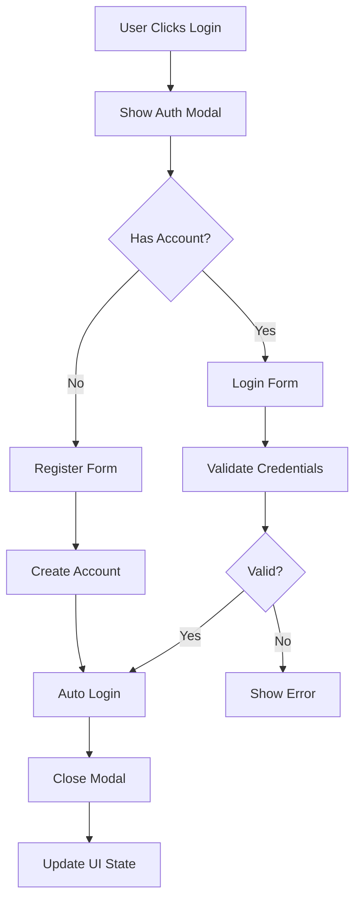
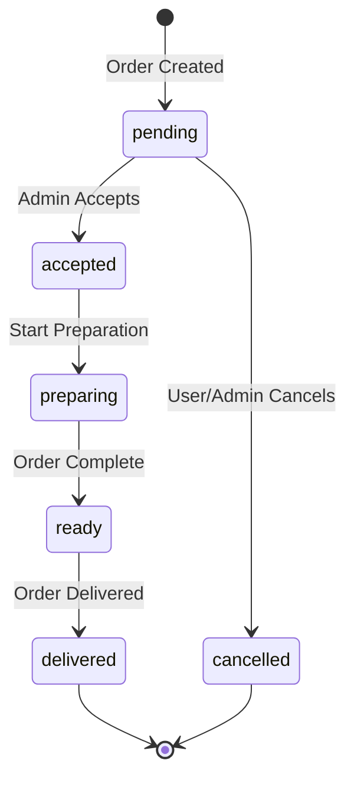

# Le Délice Moderne - Technical Documentation

## 📚 Table of Contents

1. [Architecture Overview](#architecture-overview)
2. [State Management](#state-management)
3. [Component Structure](#component-structure)
4. [Routing System](#routing-system)
5. [Authentication Flow](#authentication-flow)
6. [Order Management](#order-management)
7. [Data Models](#data-models)
8. [Styling Guide](#styling-guide)

## 🏛️ Architecture Overview

The application follows a modern React architecture with clear separation of concerns:

```
┌─────────────────┐    ┌─────────────────┐    ┌─────────────────┐
│   Presentation  │    │    Business     │    │      Data       │
│     Layer       │◄──►│     Logic       │◄──►│     Layer       │
│   (Components)  │    │   (Stores)      │    │  (Local State)  │
└─────────────────┘    └─────────────────┘    └─────────────────┘
```

### Key Principles

- **Component-based architecture** with reusable UI components
- **Centralized state management** using Zustand
- **Type-safe development** with TypeScript
- **Responsive design** with Tailwind CSS
- **Modular structure** for maintainability

## 🏪 State Management

### Zustand Store Structure

The application uses Zustand for state management, organized into logical sections:

```typescript
interface AppState {
  // Theme & UI
  isDarkMode: boolean;
  currentLanguage: 'fr' | 'en' | 'ar';
  
  // Authentication
  currentUser: User | null;
  users: User[];
  
  // Shopping
  cart: CartItem[];
  orders: Order[];
  
  // Menu Management
  menuItems: MenuItem[];
  categories: Category[];
  offers: Offer[];
  
  // Activity Tracking
  activityLogs: ActivityLog[];
  analytics: Analytics;
}
```

### Data Persistence

- **Local Storage**: User sessions, cart data, preferences
- **Session Storage**: Temporary data during user session
- **Memory**: Real-time updates and UI state

## 🧩 Component Structure

### Component Hierarchy

```
App
├── Navigation
├── Pages/
│   ├── Index (Home)
│   ├── UserDashboard
│   │   ├── UserStats
│   │   ├── RecentOrders
│   │   └── ActivityLog
│   ├── AdminDashboard
│   │   ├── AdminStats
│   │   └── OrderManagement
│   └── SpecialOfferDetail
│       ├── OfferGallery
│       └── OfferInfo
└── Footer
```

### Component Guidelines

1. **Single Responsibility**: Each component has one clear purpose
2. **Props Interface**: All props are typed with TypeScript interfaces
3. **Reusability**: Components are designed for reuse across the app
4. **Accessibility**: Components follow WCAG guidelines

## 🛣️ Routing System

### Route Structure

```typescript
const routes = [
  '/',                              // Home page
  '/menu',                          // Menu browsing
  '/menu/:id',                      // Menu item detail
  '/menu-special/:id',              // Special offer detail
  '/user/:id',                      // User dashboard
  '/user/:id/orders',               // User orders
  '/user/:id/orders/:orderId',      // Order detail
  '/user/:id/settings',             // User settings
  '/admin/login',                   // Admin login
  '/admin/dashboard',               // Admin dashboard
  '/about',                         // About page
  '/contact',                       // Contact page
  '*'                               // 404 page
];
```

### Navigation Guards

- **Protected Routes**: User and admin routes require authentication
- **Role-based Access**: Admin routes are restricted to admin users
- **Redirect Logic**: Unauthenticated users are redirected to login

## 🔐 Authentication Flow

### User Authentication Process



### Admin Authentication

- **Credentials**: Username: `admin`, Password: `admin123`
- **Session Management**: Admin sessions persist until logout
- **Access Control**: Admin-only routes and features

## 📦 Order Management

### Order Lifecycle



### Real-time Updates

- **Status Synchronization**: Order status updates are visible to both admin and customer
- **Activity Logging**: All order actions are tracked and logged
- **Notifications**: Toast notifications for status changes

## 📊 Data Models

### Core Entities

```typescript
// User Entity
interface User {
  id: string;
  name: string;
  phone?: string;
  email?: string;
  createdAt: Date;
  loyaltyPoints: number;
}

// Order Entity
interface Order {
  id: string;
  userId: string;
  items: CartItem[];
  total: number;
  status: OrderStatus;
  customerName: string;
  createdAt: Date;
  specialRequests?: string;
}

// Menu Item Entity
interface MenuItem {
  id: string;
  name: string;
  description: string;
  price: number;
  images: string[];
  category: string;
  ingredients: string[];
  available: boolean;
  featured: boolean;
  preparationTime: number;
}
```

### Relationships

- **User → Orders**: One-to-many relationship
- **Order → CartItems**: One-to-many relationship
- **MenuItem → Category**: Many-to-one relationship
- **User → ActivityLogs**: One-to-many relationship

## 🎨 Styling Guide

### Design System

#### Colors

```css
/* Primary Colors */
--orange-500: #f97316;
--yellow-500: #eab308;

/* Status Colors */
--green-500: #22c55e;   /* Success */
--red-500: #ef4444;     /* Error */
--blue-500: #3b82f6;    /* Info */
--yellow-500: #eab308;  /* Warning */
```

#### Typography

- **Headings**: Inter font family, bold weights
- **Body Text**: Inter font family, regular weights
- **Code**: JetBrains Mono font family

#### Spacing Scale

- **Base Unit**: 4px (0.25rem)
- **Common Spacing**: 4px, 8px, 12px, 16px, 24px, 32px, 48px

### Component Patterns

#### Cards

```tsx
<Card>
  <CardHeader>
    <CardTitle>Title</CardTitle>
  </CardHeader>
  <CardContent>
    Content here
  </CardContent>
</Card>
```

#### Buttons

```tsx
<Button variant="default">Primary Action</Button>
<Button variant="outline">Secondary Action</Button>
<Button variant="destructive">Delete Action</Button>
```

### Responsive Design

- **Mobile First**: Design starts with mobile, enhances for larger screens
- **Breakpoints**: sm (640px), md (768px), lg (1024px), xl (1280px)
- **Grid System**: CSS Grid and Flexbox for layouts

## 🔧 Development Guidelines

### Code Style

- **ESLint**: Enforces code quality rules
- **Prettier**: Automatic code formatting
- **TypeScript**: Strict type checking enabled

### Component Guidelines

1. Use functional components with hooks
2. Implement proper TypeScript interfaces
3. Follow the single responsibility principle
4. Use meaningful component and prop names
5. Include JSDoc comments for complex logic

### Testing Strategy

- **Unit Tests**: Test individual components and functions
- **Integration Tests**: Test component interactions
- **E2E Tests**: Test complete user workflows

### Performance Optimization

- **Code Splitting**: Lazy load routes and components
- **Memoization**: Use React.memo for expensive renders
- **Bundle Analysis**: Monitor bundle size regularly

---

This documentation provides a comprehensive overview of the application architecture and development practices. For specific implementation details, refer to the source code and inline comments.
